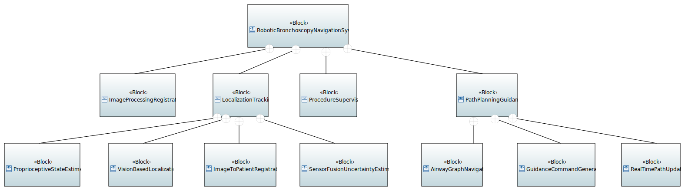
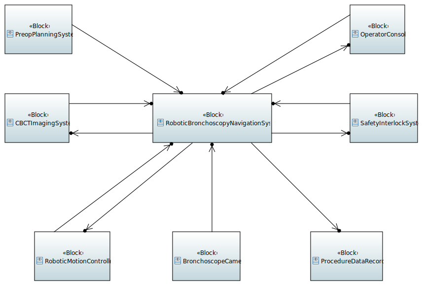
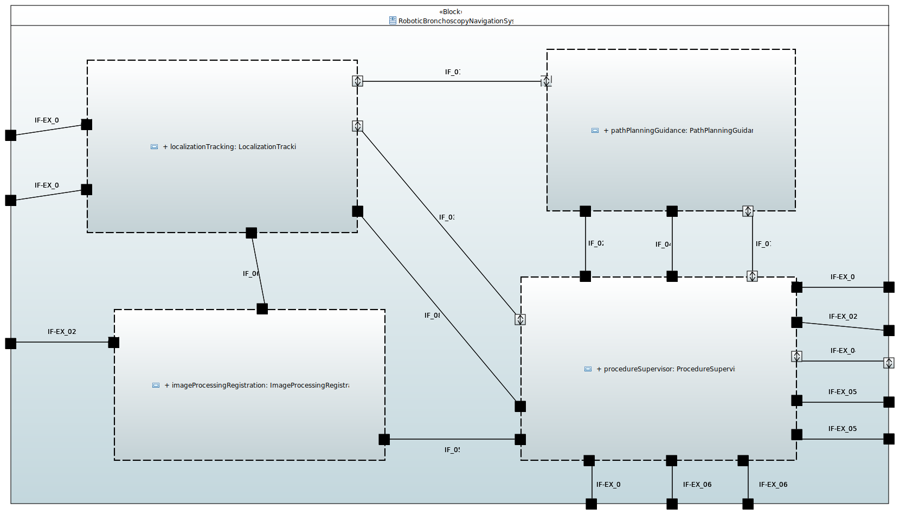
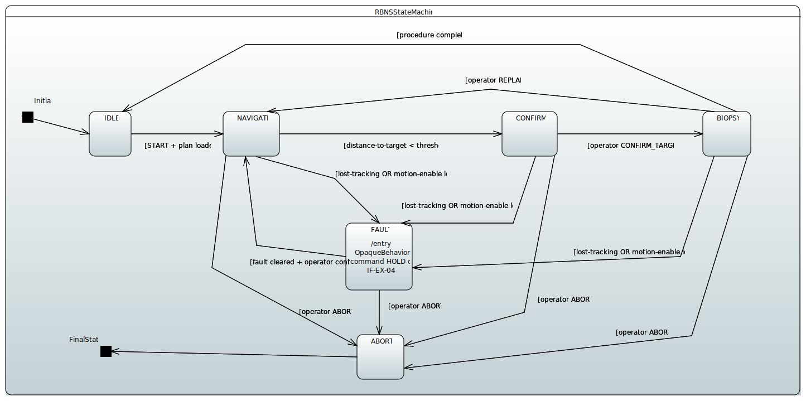
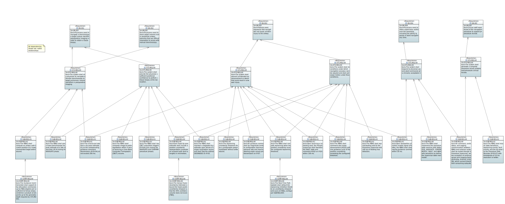

# Robotic Bronchoscopy Navigation Subsystem — Functional Architecture Model

A systems engineering portfolio project demonstrating functional decomposition, interface management, requirements allocation, and SysML modeling for a bounded robotic surgical subsystem.

## Overview

This project develops a functional architecture model for a **Robotic Bronchoscopy Navigation Subsystem (RBNS)** — the software subsystem responsible for intraoperative localization, path planning, and guidance command generation in a robotic bronchoscopy platform.

The system boundary is deliberately narrow: the RBNS receives a preoperative airway model and target nodule coordinates, maintains a real-time estimate of bronchoscope tip position using multi-source sensor fusion, and outputs motion guidance commands to a downstream robot motion controller. It excludes the robot kinematics stack, the Cone Beam Computed Tomography (CBCT) imaging hardware, and the surgeon console rendering pipeline.

## Repository Structure

```
├── docs/
│   ├── interface_registry.md    ← CANONICAL interface definitions (3 tiers, 26 interfaces)
│   ├── requirements.md          ← Full requirements hierarchy: user needs, system requirements (full bronchoscopy system), subsystem requirements (RBNS), and component requirements, with allocation and verification methods
│   ├── requirements.csv         ← Requirements in medtrace-compatible format with test case linkage
│   ├── test_cases.csv           ← Planned verification activities linked to requirements
│   ├── rtm.html                 ← medtrace-generated Requirements Traceability Matrix (HTML)
│   ├── rtm.pdf                  ← medtrace-generated Requirements Traceability Matrix (PDF)
│   ├── design_decisions.md      ← 6 key architectural decisions with rationale
│   └── sysml_build_plan.md      ← SysML diagram set specification and build sequence
├── model/
│   ├── diagrams/                ← Exported SVG diagrams (D1–D8)
│   └── Robotic-Surgical-Architecture.*  ← Papyrus SysML project files
└── sketches/                    ← Preliminary draw.io concept sketches (superseded)
```

## SysML Model

The formal model is built in **Papyrus with the SysML 1.6 profile**, comprising 8 diagrams:

| Diagram | Type | Content |
|---|---|---|
| D1 | Package | Model organization |
| D2 | BDD | System context — RBNS + 7 external actors |
| D3 | BDD | Structural hierarchy — full composition tree |
| D4 | IBD | RBNS internal structure — 4 subsystems, internal and external interfaces |
| D5 | IBD | Localization & Tracking decomposition — sensor fusion architecture |
| D6 | IBD | Path Planning & Guidance decomposition — replanning feedback loop |
| D7 | STM | RBNS procedure state machine |
| D8 | REQ | Requirements traceability — full hierarchy from user needs through component requirements |

### D3 — Structural Hierarchy



### D2 — System Context



### D4 — RBNS Internal Structure



### D7 — RBNS State Machine



### D8 — Requirements Traceability



### Additional Diagrams

- [D1 — Model Organization](model/diagrams/D1_model_organization.svg)
- [D5 — Localization & Tracking IBD](model/diagrams/D5_localization_tracking_ibd.svg)
- [D6 — Path Planning & Guidance IBD](model/diagrams/D6_path_planning_guidance_ibd.svg)

## Architecture Summary

```
RBNS
├── 1.0 Localization & Tracking Subsystem
│   ├── 1.1 Proprioceptive State Estimator (forward kinematics, high-rate/low-accuracy)
│   ├── 1.2 Vision-Based Localization (feature matching, medium-rate)
│   ├── 1.3 Image-to-Patient Registration (Iterative Closest Point on CBCT, low-rate/high-accuracy)
│   └── 1.4 Sensor Fusion & Uncertainty Estimator (Extended Kalman Filter → uncertainty ellipsoid on IF-01)
│
├── 2.0 Path Planning & Guidance Subsystem
│   ├── 2.1 Airway Graph Navigator (A* on preop airway graph)
│   ├── 2.2 Real-Time Path Updater (deviation detection; replanning inhibition under uncertainty)
│   └── 2.3 Guidance Command Generator (safety-bounded advance/steer commands)
│
├── 3.0 Image Processing & Registration Subsystem
│   (CBCT volume ingestion; registration + confidence score output)
│
└── 4.0 Procedure Supervisor
    (Primary external interface point; procedure state machine; centralized fault handling)
```

## Key Design Decisions

1. **Sensor fusion over single-source ground truth** — CBCT registration is periodic (dose-limited), so an Extended Kalman Filter (EKF) fuses it with continuous proprioceptive and vision estimates, treating CBCT as a periodic high-accuracy correction.

2. **Uncertainty as an explicit interface signal** — IF-01 carries a 3D uncertainty ellipsoid alongside the pose estimate. Path planning gates replanning on this value (SUB-REQ-004): the system will not replan from a position it cannot trust.

3. **Paired fault detection and response requirements** — Lost-tracking detection (SUB-REQ-010, ≤100 ms) and Supervisor response (SUB-REQ-012, ≤100 ms) are separately specified and allocated, making the fault chain testable end to end.

4. **Supervisor as primary external interface point, with a defined exception for high-rate sensor feeds** — Command, control, status, and logging interfaces route through the Supervisor (SUB-REQ-009). High-rate sensor feeds (encoder telemetry, endoscopic video, CBCT volume) connect directly to their consuming subsystem to avoid throughput bottlenecks.

5. **Interface registry as change-controlled single source of truth** — A three-tier registry governs all artifacts. The registry audit caught two real defects in the preliminary sketches: an undocumented boundary crossing (bronchoscope camera feed) and a routing contradiction (guidance commands bypassing the Supervisor).

6. **Requirements hierarchy scoped by level** — User needs describe clinical intent. System requirements are scoped to the full bronchoscopy platform. Subsystem requirements are scoped to the RBNS. Component requirements are derived values produced by analysis, not asserted from clinical need.

## Requirements Traceability

31 requirements across four tiers (user needs, system, subsystem, component) are linked to 31 planned verification activities via [medtrace](https://github.com/cameron-murr/medtrace). All test cases carry `not_run` status, reflecting that this is an architecture-phase model — the test cases represent the verification plan that would be executed as the system is implemented.

- [RTM — HTML](docs/rtm.html)
- [RTM — PDF](docs/rtm.pdf)

## Process Note

The `/sketches` directory contains the initial draw.io concept diagrams. They were superseded when the project moved to a formal Papyrus SysML model driven by the interface registry — and they contain the two defects the registry audit caught, retained deliberately as evidence of the review process.

## Related Work

This project was traced using [medtrace](https://github.com/cameron-murr/medtrace), a Python CLI requirements traceability tool built as a companion portfolio project.

---

*Portfolio artifact. Architecture is original work informed by publicly available information about robotic bronchoscopy and image-guided navigation systems generally; not derived from proprietary information of any specific commercial product.*
